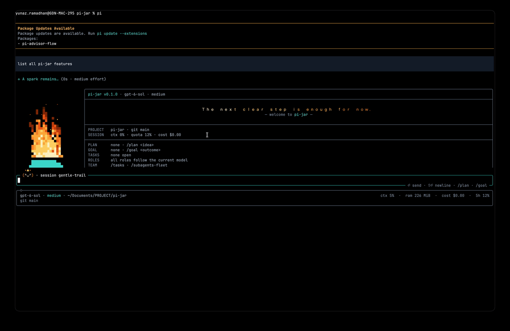

# pi-jar

A warm, role-aware TUI and workflow extension for [Pi](https://github.com/earendil-works/pi). pi-jar turns the terminal into a more expressive agent workspace with a living pixel-fire welcome, an adaptive composer, first-class **plan**, **goal** and **role** workflows, tracked tasks, reviewable changes, background shells and parallel subagents.

> Works with the current `@earendil-works/*` Pi API. Pi's core packages are peer dependencies (`"*"`), so pi-jar always runs against the Pi you have installed; it is tested against the latest release (0.87.x).

## See it in action



The showcase is captured from a real pi-jar terminal session: the torch-style `π`, animated flame and embers, live workspace state, tasks, roles and composer are the actual TUI rather than a mockup. Capture and media guidelines live in [docs/SHOWCASE.md](docs/SHOWCASE.md).

## Highlights

| Area | What you get |
| --- | --- |
| **Welcome** | A natural pixel flame (rounded base, swaying tip, wisps, embers and sparks) over a large `π`; a large, flame-colored welcome message up top; a live card with project, git, session, plan, goal, tasks and roles; clickable actions (fullscreen) or keyboard hints (regular mode). |
| **Composer** | Rounded input that grows with your draft (up to ~60% of the terminal), click-to-place cursor in fullscreen, dim **next-prompt suggestions** you accept with <kbd>Tab</kbd>, and **Ember** — a tiny flame mascot that blinks, cheers, focuses, dozes and reacts. |
| **Plan mode** | Read-only exploration; the agent must write a structured plan file and submit it. You review it in a split view (headings on the left, section on the right) and approve, compact-and-approve, refine or stop. |
| **Goal mode** | Set an outcome; the agent must break it into tracked tasks and keeps working until they are done, then an **auditor** pass verifies the goal before it can be marked complete. |
| **Roles** | Named model roles (`default`, `smol`, `slow`, `plan`, `implement`, `advisor`, `task`, `commit`, plus your own) with `@alias` chains, `:effort` suffixes and project overrides; switched automatically as you move between plan, execution, goal rounds and audits, and never over a model you picked yourself. |
| **Advisor** | A second-opinion model: the agent calls `jar_advisor` for risky decisions or when stuck, `/advisor [focus]` asks on demand, and automatic gates consult it when the agent repeats the same tool call or keeps failing. |
| **Usage & context** | `/usage` shows session cost and tokens per model (advisor and commit calls included) and plan-limit bars with reset times; `/context` draws a grid of what fills the context window, with a per-file, per-skill and per-tool breakdown. |
| **Commit** | `/jar commit [note]` drafts a message for the staged changes with the `commit` role, lets you edit it, then commits (never pushes). |
| **Tasks & questions** | A Claude-style `jar_todo` checklist the agent maintains itself, and `jar_ask` structured questions with options, multi-select and free-form answers. |
| **Change review** | Every file the agent edits is remembered as it was; `/diff` (<kbd>Ctrl</kbd>+<kbd>Alt</kbd>+<kbd>D</kbd>) shows changed files next to a colored diff, with accept or revert per file or all at once. |
| **Background shells** | `jar_shell` runs dev servers, watchers and long tests in the background; the agent is woken when a watch pattern matches or the process exits, so it never polls. `/jar shells` tails or kills them. |
| **Subagents** | `jar_delegate` fans out up to four read-only (or opt-in editing) subagents in parallel on your model roles; they show up live as teammates on the welcome card and footer. |
| **Sessions & history** | Recent sessions (with their goal and plan) on the welcome card, one click from resuming; <kbd>Ctrl</kbd>+<kbd>Alt</kbd>+<kbd>H</kbd> searches earlier prompts; pasted images show as chips under the composer. |
| **Footer & themes** | Responsive footer (model, effort, session, cwd, context, RAM, cost, quota, goal, roles, branch) and seven dark themes. |

## Install

```bash
pi install git:github.com/ygrip/pi-jar
```

Restart Pi, then pick a theme with `/settings`: `pi-jar-dark`, or `pi-jar-dark-<accent>` (`gray`, `pink`, `teal`, `azure`, `violet`, `amber`). For the closest match set your terminal background to `#0B1018` (Pi themes cannot change the terminal's own background).

Loading only `--extension ./extensions/index.ts` does not register the bundled themes; install the package or also pass `--theme ./themes`. Do not load pi-jar twice.

### Mouse, clicks and copy-on-select

Pi only delivers mouse events in its **fullscreen** TUI mode. In regular mode the terminal owns scrollback and selection, so pi-jar shows keyboard shortcuts instead of buttons.

- Turn it on in **`/jar settings` → Pi → Mouse clicks** (writes Pi's `tuiMode`; restart Pi), or start with `pi --tui-mode fullscreen`.
- In fullscreen, selecting text copies it automatically (**Pi → Copy on select**, on by default). pi-jar's own views never capture drags, so selection works over the welcome, composer, plan view and dialogs.
- In regular mode, use your terminal's own copy-on-select option if it has one.

## Commands and shortcuts

| Command | Purpose |
| --- | --- |
| `/plan [request]` | Enter plan mode (optionally sending the request). `/plan review` reopens the plan view; `/plan off` exits. |
| `/goal <outcome>` | Start goal mode. `/goal` edits, `/goal status`, `/goal pause`, `/goal resume`, `/goal clear`. |
| `/roles` | Role manager. `/roles set ROLE provider/model[:effort]\|@role [--project]`, `/roles clear ROLE`, `/roles <role>` activates, `/roles cycle`, `/roles list`. |
| `/advisor [focus]` | Ask the advisor for a second opinion on the current work; the answer joins the conversation. |
| `/usage` · `/context` | Usage (cost, tokens per model, plan limits) and context-window breakdown in one tabbed panel. |
| `/jar commit [note]` | Draft a commit message for the staged changes with the `commit` role, edit it, and commit. Offers `git add -A` when nothing is staged. |
| `/jar` · `/jar settings` | Visual and workflow preferences. |
| `/jar status` | One-line status summary. |
| `/jar tasks [list\|add\|done\|open\|edit\|delete]` | Human view/editor for the agent's checklist. |
| `/jar history` | Read-only conversation timeline for the active branch. |
| `/diff` | Review, accept or revert the files the agent changed. |
| `/jar shells` | Background shells: live output, kill. |
| `/jar resume [N]` | Resume recent session `N` from the welcome list, or pick one. |
| `/jar sessions [query]` · `/jar name <title>` | Search/switch sessions; name the current one. |
| `/jar welcome` | Replay the welcome screen. |
| `/jar ask [question]` | Answer a question in a dialog and insert the answer into the editor. |
| `/jar accent [preset]` · `/jar footer` | Switch a loaded accent theme; toggle footer fields. |
| `/jar composer on\|off` · `/jar animations on\|off` · `/jar ui on\|off` | Toggle the composer, motion, or all pi-jar UI. |
| `/jar quota on\|off` | Session-only, read-only quota lookups for supported OAuth providers. |
| `/jar hub` | Open an installed task or subagent manager command. |
| `/jar demo` · `/jar reset` | Labeled sample roles in the footer / back to live data. |

| Shortcut | Action |
| --- | --- |
| <kbd>Ctrl</kbd>+<kbd>Alt</kbd>+<kbd>S</kbd> | Open pi-jar settings |
| <kbd>Ctrl</kbd>+<kbd>Alt</kbd>+<kbd>R</kbd> | Refresh the welcome (new message and flame), or show it again |
| <kbd>Ctrl</kbd>+<kbd>Alt</kbd>+<kbd>P</kbd> | Toggle plan mode |
| <kbd>Ctrl</kbd>+<kbd>Alt</kbd>+<kbd>M</kbd> | Cycle model roles (`cycleOrder`) |
| <kbd>Ctrl</kbd>+<kbd>Alt</kbd>+<kbd>D</kbd> | Review agent changes (`/diff`) |
| <kbd>Ctrl</kbd>+<kbd>Alt</kbd>+<kbd>H</kbd> | Search earlier prompts into the composer |
| <kbd>Tab</kbd> / <kbd>→</kbd> in an empty composer | Accept the dim suggestion into the input (it is not sent) |

## Welcome screen

The welcome stays until your first prompt, then dissolves (or hides immediately with motion off).

- **Flame** — one continuous flame with a rounded base and a tip that sways and licks, animated with smooth noise and drawn with half-block "pixels" in a ten-step ember→gold palette. Wisps break off the tip; embers and sparks rise from it. Every frame is deterministic per seed, so motion-off shows a frozen, still-lit flame. Terminals without 24-bit color get shaded blocks in theme colors. See [docs/FLAME.md](docs/FLAME.md).
- **Card** — `pi-jar` version, model, effort and active role; a large hopeful message; project + git branch/dirty; context, quota and cost; plan state; goal progress; open tasks with the next one; configured roles; live teammates (other extensions and `jar_delegate` subagents); and **RECENT** — the last three sessions with their goal and plan. Click a recent row (or run `/jar resume N`) to continue it.
- **Actions** — `[ ⚙ Settings ]  [ ↻ Refresh ]  [ ◆ Roles ]  [ ▤ Plan ]  [ ◎ Goal ]` in fullscreen (act on press). In regular mode the same row shows `ctrl+alt+s settings · ctrl+alt+r refresh · /roles · /plan · /goal`.

## Composer

- **Grows with your draft**: the input expands to about 60% of the terminal before it scrolls (overflow shows `↑/↓ N more` in the border).
- **Click to place the cursor** (fullscreen), including multi-line drafts. Autocomplete menus (including Pi's `@file` fuzzy search) render below the frame.
- **Image chips**: images you paste (<kbd>Ctrl</kbd>+<kbd>V</kbd>) or reference by path appear under the frame as `▣ pasted png · 1280×720 · 240 KB`.
- **Prompt history search**: <kbd>Ctrl</kbd>+<kbd>Alt</kbd>+<kbd>H</kbd> fuzzy-searches every prompt in this session and the opening prompts of recent ones; <kbd>Enter</kbd> puts the pick in the composer to edit. <kbd>↑</kbd>/<kbd>↓</kbd> still walks Pi's history.
- **Next-prompt suggestions**: when the agent finishes a request it proposes one likely next prompt (`jar_suggest`). It appears as dim ghost text in the empty input; <kbd>Tab</kbd> (or <kbd>→</kbd>, or a click on it) fills it in so you can edit and press <kbd>Enter</kbd>. Typing, sending, or a new run clears it. Toggle in settings.
- **Ember the mascot** perches on the top-left of the input — the face sits in the border, the flickering tips just above:

  | Mood | Face | When |
  | --- | --- | --- |
  | idle / blink | `(•ᴗ•)` `(-ᴗ-)` | waiting for you; blinks every few seconds |
  | happy / thinking | `(^ᴗ^)` `(°ᴗ°)` | the agent is generating |
  | focused | `(>ᴗ<)` | a tool is running (sparks fly) |
  | curious | `(•o•)` | a question or dialog is open |
  | sleepy | `(-ω-)` | idle for two minutes (`z` rises) |
  | oops | `(×_×)` | a run failed |
  | proud | `(★ᴗ★)` | a goal was completed |
  | poked | `(^o^)` | you clicked it |

  The title also shows Pi's session name (or a stable readable alias like `silver-lantern`). Toggle the mascot in settings; `/jar composer off` restores Pi's editor with your draft intact.

## Plan mode

`/plan` switches Pi into read-only planning:

1. **Tools are gated.** Only known read-only tools stay active; `bash` is limited to an inspection allowlist; a second guard blocks unsafe calls even if another extension exposes them. `write`/`edit` are allowed **only** for markdown files in the plan directory (`$TMPDIR/pi-jar/plans/<session>/`, resolved through symlinks).
2. **The `plan` role is applied** if assigned, and restored afterwards. An active goal loop pauses.
3. **The agent writes a plan file** such as `<slug>-plan.md` and must end its turn with `jar_plan_submit`. The file is validated; an incomplete plan is sent back with the missing parts. If the agent ends a turn without submitting, pi-jar reminds it (at most twice per prompt) instead of accepting a chat-only plan.

Required structure:

```markdown
# <Plan title>

## Context
Why, the literal request, and the intended end state.

## Approach
1. Ordered steps grouped by behavior, naming exact files, symbols, reused helpers and error handling.

## Critical files
- `path/to/file.ts` — symbol — why it changes

## Verification
- Exact commands and at least one concrete check of new behavior.

## Assumptions
- Decisions the user could override, each with a fallback.
```

4. **Plan view** — a full-screen split view: headings on the left (the lone `#` title becomes the header, `###` steps are indented), the selected section rendered as markdown on the right, actions below.
   - Keys: <kbd>Tab</kbd> cycles focus (headings → body → actions), <kbd>↑↓</kbd>/<kbd>j k</kbd> move or scroll, <kbd>g</kbd>/<kbd>G</kbd>, <kbd>PgUp</kbd>/<kbd>PgDn</kbd>, <kbd>1–4</kbd> pick an action, <kbd>e</kbd> edits the plan (saved back to the file), <kbd>r</kbd> cycles the **continue with** role, <kbd>Esc</kbd> stops. Fullscreen: click headings and actions, wheel scrolls the pane under the pointer.
   - Actions: **Approve & execute**, **Approve, compact & execute** (compaction keeps the plan), **Refine** (send feedback, stay in plan mode), **Stop**.
5. **Execution** seeds `jar_todo` from the Approach steps, restores tools and model, optionally switches to the chosen role, and sends the full plan inline (`<plan path="…">…</plan>`) with instructions to work step by step and verify each step.

Plan state is stored in the session branch, so reloading or navigating the tree restores it. Narrow terminals collapse the headings into a `‹ n/m heading ›` pager.

## Goal mode

`/goal Ship the export command` starts an implement → audit loop:

- **Tasks first.** While a goal is active and no task is open, `write`/`edit` and non-read-only shell commands are blocked with "create jar_todo tasks for the goal first". The agent sees the goal and its current checklist at the start of every run.
- **Implementor.** When a turn ends normally with open tasks (or none yet), pi-jar continues automatically with a hidden continuation listing the goal and open tasks.
- **Auditor.** When every task is done, the next round switches to the `advisor` role (if assigned) and asks for an independent audit against the repository: run the checks, look for missed requirements. The auditor either adds tasks for gaps (edits stay blocked during the audit), which sends work back to the implementor, or calls `jar_goal complete` with concrete evidence. Completion is refused outside the audit, while tasks are open, or without evidence.
- **Guard rails.** The loop pauses when you interrupt (<kbd>Esc</kbd>), a run fails, plan mode starts, the agent calls `jar_goal block` (it needs you), or the round budget runs out (default 8 automatic rounds per user message; settings → Pi → Goal auto rounds). A new message from you resets the budget. `/goal resume` continues.
- The footer and welcome show progress: `◎ goal · Ship · 3/5 tasks · round 2/8 · auditing`.

## Model roles

Roles map a purpose to a model. They live in `~/.pi/agent/pi-jar-roles.json` (Pi's agent directory), with optional per-project overrides in `<project>/.pi/pi-jar-roles.json`:

```json
{
  "version": 2,
  "roles": {
    "default": "anthropic/claude-sonnet-5",
    "slow": "anthropic/claude-opus-5-5:high",
    "plan": "@slow",
    "advisor": "@slow:xhigh",
    "smol": "anthropic/claude-haiku-4-5-20251001",
    "review": "openai/gpt-5:medium"
  },
  "cycleOrder": ["smol", "default", "slow"],
  "tags": { "review": { "name": "Reviewer" } }
}
```

- Specs are `provider/model[:effort]`, `@role[:effort]` (alias) or `*` (= `@default`). An effort on the referring role wins over the target's. Alias chains are followed up to five levels; cycles are reported.
- **Built-in roles and where pi-jar uses them:**
  | Role | Used for |
  | --- | --- |
  | `default` | applied at session start |
  | `plan` | plan mode (restored when you leave it) |
  | `implement` | executing an approved plan and goal implement rounds (falls back to the current model) |
  | `advisor` | `jar_advisor`, `/advisor`, stuck-work gates and the goal audit |
  | `task` | `jar_delegate` subagents |
  | `commit` | `/jar commit` messages |
  | `smol` / `slow` | cycling with <kbd>Ctrl</kbd>+<kbd>Alt</kbd>+<kbd>M</kbd> |

  Any other valid name (`a-z`, `0-9`, `-`) is a custom role.
- **Switching is automatic and scoped.** Entering plan mode applies `plan`; approving applies your chosen role or `implement` for the run; goal rounds alternate `implement` and `advisor`. Each temporary switch restores the previous model afterwards — unless you picked a model or effort yourself in the meantime, which always wins.
- `/roles` opens a split manager: role list on the left; resolved model, alias chain, effort, scope and usage on the right. Keys: `m` model, `a` alias, `t` effort, `s` move between global/project scope, <kbd>Enter</kbd> activate, `c` clear, `n` new role, `d` delete custom role.
- Older v1 files are read and upgraded in memory; they are rewritten as v2 only when you change a role.

## Advisor

The advisor is a second model (the `advisor` role; the current model if unassigned) that sees a fresh view of the recent conversation plus `git status` and a diff stat, but cannot run tools.

- **`jar_advisor({ question?, draft? })`** — the agent is told to use it before risky or hard-to-reverse choices, after two failed attempts, and before declaring complex work done; it passes its own candidate as `draft`. Available in plan mode too.
- **`/advisor [focus]`** — ask on demand; the answer is added to the conversation (visible) for the agent's next turn.
- **Gates** — when the agent makes the same tool call three times within its last eight calls, the call is blocked and the advisor's review is returned instead; after three failing tool results in a row, the advice is steered into the running turn. At most two automatic consultations per prompt.
- Settings → Pi toggles the advisor and the gates. Advisor calls are counted in `/usage`. The footer and welcome show it as a working teammate while it thinks.

## Usage and context

`/usage` and `/context` open one tabbed panel (<kbd>Tab</kbd> switches, <kbd>Esc</kbd> closes):

- **Usage** — total cost, duration, prompts and responses, tokens (input, output, cache read/write); a per-model breakdown including advisor and commit calls; and, for Anthropic and OpenAI Codex subscriptions, 5-hour and weekly limit bars with reset times (lookups follow `/jar quota on|off`).
- **Context** — a 10×10 grid (each cell ≈ 1% of the window) beside a legend: system prompt, tools, context files, skills, compaction summary, user and assistant messages, tool results, extension messages, free space and the autocompact buffer. Parts are estimated at ~4 characters per token and scaled to the provider-reported total when one is known; context files, skills and tools are listed individually below.

## Tasks, questions and history

- **`jar_todo`** — a Claude-style task list the agent keeps for any multi-step request. It writes the full list at once; each task is `pending`, `in_progress` (exactly one at a time) or `completed`, with an `activeForm` ("Running tests") that replaces the working spinner text while it runs. The live checklist above the composer shows `✔` struck-through done tasks, a bold `◼` current task and `☐` pending ones; a finished list stays until your next prompt. `/jar tasks` is your view/editor: `a` add, <kbd>Space</kbd>/<kbd>Enter</kbd> check, `e` edit, `d` delete, `f` filter.
- **`jar_ask`** — structured questions: numbered options with descriptions, single or multi-select, *Type your own answer* (multi-line, paste-friendly) and *Chat about this* to discuss before choosing.
- **`/diff`** — review what the agent changed since its first edit to each file: files with `+/−` counts on the left, a numbered, colored diff on the right. `a` accept (keep, stop tracking), `r` then `y` revert (restore the original, or remove a file it created), `A`/`R` for all. The footer shows `± N files · /diff` while anything is unreviewed. Only `edit`/`write` changes inside the project are tracked; shell-made changes are not.
- **`jar_shell`** — `start` (with optional `name`, `watch` regex and `notify`), `list`, `output`, `kill`. Output is ANSI-stripped and bounded (2000 lines). When a watch matches or the process ends, a visible message wakes the agent (queued if it is busy). The footer shows `⚙ N shells`; `/jar shells` opens a live view (`x` kill, `f` follow). All shells stop when the session ends.
- **`jar_delegate`** — up to four subagents run in parallel as separate one-shot Pi processes with a fresh context, on a role (default `task`, then `default`, then the current model). They are read-only (`read`, `grep`, `find`, `ls`) unless `write: true`; subagents cannot delegate further; aborting the turn stops them. Each shows as a working teammate until it finishes, and the tool result lists every report.
- **`/jar history`** — separate, read-only timeline of the active branch (paging, search, expandable details). Pi's native transcript is untouched.
- Pi's built-in read/shell/edit/write tool cards render compactly; the full output or diff stays one click or <kbd>Ctrl</kbd>+<kbd>O</kbd> away.

## Settings

`/jar settings` (or <kbd>Ctrl</kbd>+<kbd>Alt</kbd>+<kbd>S</kbd>, or the welcome's Settings action) has three tabs:

- **Appearance** — accent, motion, rounded composer, Ember mascot, next-prompt suggestions, pi-jar UI.
- **Footer** — field visibility.
- **Pi** — mouse clicks (Pi fullscreen mode), copy on select, goal auto rounds, advisor, advisor gates.

pi-jar preferences are saved in `pi-jar-settings.json` in Pi's agent directory; the Pi tab writes Pi's own settings.

## Integrations

Other extensions can publish teammate roles and quota windows through Pi's public status API; see [docs/INTEGRATIONS.md](docs/INTEGRATIONS.md).

## Repository structure

```text
pi-jar/
├── extensions/index.ts   extension entry: wiring, welcome, footer, commands
├── src/
│   ├── flame.ts          pixel fire simulation
│   ├── mascot.ts         Ember's moods and sprites
│   ├── composer.ts       rounded composer, ghost text, mouse mapping
│   ├── suggest.ts        jar_suggest tool and suggestion state
│   ├── plan*.ts          plan mode, plan parsing/validation, plan view
│   ├── goal*.ts          goal state and the implement → audit loop
│   ├── model-roles.ts    role config, resolution, activation
│   ├── roles-ui.ts       role manager
│   ├── advisor.ts        jar_advisor, /advisor and stuck-work gates
│   ├── side-model.ts     one-shot role model calls and their usage
│   ├── commit.ts         /jar commit
│   ├── usage-view.ts     /usage; context-view.ts is /context; panel.ts frames both
│   ├── split-view.ts     shared two-pane frame
│   ├── changes.ts        change tracker and line diff; diff-view.ts is /diff
│   ├── shells.ts         background shells, jar_shell and /jar shells
│   ├── delegate.ts       jar_delegate subagents
│   ├── attachments.ts    image chips; prompt-search.ts is prompt history
│   ├── session-gallery.ts recent sessions for the welcome
│   ├── welcome.ts        welcome layout and hit-testing
│   └── …                 footer, tasks, questions, history, settings, quota
├── themes/               native Pi themes
├── tests/                node:test suites
└── docs/                 design, workflows, flame, integrations, development
```

## Documentation

- [docs/SHOWCASE.md](docs/SHOWCASE.md) — README demo capture and media guidelines.
- [docs/WORKFLOWS.md](docs/WORKFLOWS.md) — plan, goal, roles and suggestions in depth.
- [docs/DESIGN.md](docs/DESIGN.md) — palette, motion, layout and accessibility.
- [docs/FLAME.md](docs/FLAME.md) — how the flame and mascot are drawn.
- [docs/INTEGRATIONS.md](docs/INTEGRATIONS.md) — public status contracts.
- [docs/DEVELOPMENT.md](docs/DEVELOPMENT.md) — setup, testing and release checks.
- [docs/PLAN.md](docs/PLAN.md) — roadmap.

## Contributing

See [CONTRIBUTING.md](CONTRIBUTING.md).

## License

MIT. See [LICENSE](LICENSE).
